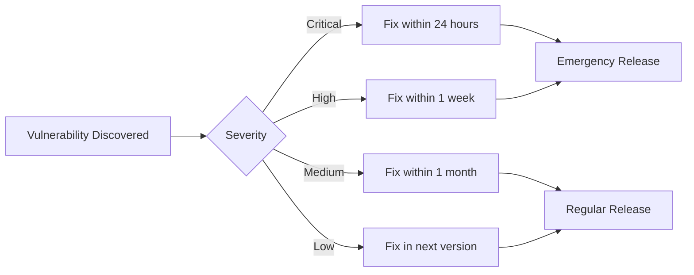

<!--
Maintenance: This document is maintained with reference to the project documentation structure defined in [README.md](../../../../../README.md).
Structure: architecture > system-architecture > technology-stack > dependency-management
-->
# Dependency Management Strategy

## Overview

This document defines the project's dependency management strategy to ensure security, stability, and maintainability of dependencies.

## Dependency Classification

### Core Dependencies

**Definition**: Runtime-required dependencies that directly affect core functionality

| Dependency Name | Version | Purpose | License | Update Strategy |
|-----------------|---------|---------|---------|-----------------|
| `[Dependency 1]` | `[Version]` | `[Purpose description]` | `[License type]` | `[Active/Passive/Locked]` |
| `[Dependency 2]` | `[Version]` | `[Purpose description]` | `[License type]` | `[Active/Passive/Locked]` |

### Development Dependencies

**Definition**: Dependencies used only during development and build phases

| Dependency Name | Version | Purpose | Update Strategy |
|-----------------|---------|---------|-----------------|
| `[Dependency 1]` | `[Version]` | `[Purpose description]` | `[Active/Passive]` |
| `[Dependency 2]` | `[Version]` | `[Purpose description]` | `[Active/Passive]` |

### Optional Dependencies

**Definition**: Enhancement dependencies that are not required

| Dependency Name | Version | Purpose | Enable Condition |
|-----------------|---------|---------|------------------|
| `[Dependency 1]` | `[Version]` | `[Purpose description]` | `[Enable condition]` |

## Version Management Strategy

### Version Pinning Rules

```
Semantic Version Format: MAJOR.MINOR.PATCH

Pinning Strategy:
- Core Dependencies: Pin MAJOR.MINOR (allow PATCH updates)
  Example: ^1.2.0 (allows 1.2.x)
  
- Development Dependencies: Pin MAJOR (allow MINOR and PATCH updates)
  Example: ^1.0.0 (allows 1.x.x)
  
- Security-Critical Dependencies: Fully pin version
  Example: 1.2.3 (no automatic updates allowed)
```

### Update Strategy

| Update Type | Trigger Condition | Testing Requirements | Approval Process |
|------------|-------------------|---------------------|------------------|
| **PATCH Update** | Security patches, bug fixes | Automated tests pass | Auto-approve |
| **MINOR Update** | New features, performance optimization | Full regression testing | Tech lead approval |
| **MAJOR Update** | Breaking changes | Comprehensive testing + impact assessment | Architecture committee approval |

## Dependency Review Process

### New Dependency Checklist

- [ ] **Necessity Assessment**: Are there alternatives? Can we implement it ourselves?
- [ ] **License Compatibility**: Is the license compatible with the project?
- [ ] **Security Check**: Any known vulnerabilities? CVE records?
- [ ] **Maintenance Status**: Recent update time? Community activity?
- [ ] **Performance Impact**: Package size? Runtime overhead?
- [ ] **Dependency Chain Analysis**: Number of transitive dependencies? Conflicts introduced?
- [ ] **Documentation Quality**: Is API documentation complete?
- [ ] **Community Support**: GitHub Stars? Download count? Issue response speed?

### Review Tools

```bash
# Security vulnerability scanning
npm audit / pip-audit / snyk test

# License checking
license-checker / pip-licenses

# Dependency analysis
npm ls / pip show / dependency-tree

# Outdated checking
npm outdated / pip list --outdated
```

## Security Management

### Vulnerability Response Process



### Security Scanning Schedule

- **Daily**: Automated security scanning (CI/CD integrated)
- **Weekly**: Dependency update checks
- **Monthly**: Complete dependency audit
- **Quarterly**: Dependency cleanup and optimization

## License Management

### Permitted Licenses

**Production Dependencies**:
- ✅ MIT, Apache 2.0, BSD (2/3-Clause)
- ✅ ISC, CC0
- ⚠️ LGPL (requires special approval)
- ❌ GPL, AGPL (prohibited)

**Development Dependencies**:
- ✅ All OSI-approved open source licenses

### License Conflict Resolution

1. Identify conflicting licenses
2. Assess legal risks
3. Find alternative dependencies
4. Consult legal team if necessary

## Dependency Cleanup Strategy

### Regular Cleanup Tasks

**Execute Quarterly**:
- [ ] Remove unused dependencies
- [ ] Merge functionally duplicate dependencies
- [ ] Upgrade outdated dependencies
- [ ] Optimize dependency tree depth

### Cleanup Tools

```bash
# Detect unused dependencies
depcheck / pip-autoremove

# Analyze package size
webpack-bundle-analyzer / source-map-explorer

# Dependency tree visualization
npm ls --depth=0 / pipdeptree
```

## Private Dependency Management

### Private Package Registry

**Configuration Example**:
```
Registry URL: [Private registry address]
Authentication: [Token/Username-Password]
Access Permissions: [Team/Project level]
```

### Internal Dependency Versioning

- Follow semantic versioning specification
- Use monorepo to manage related packages
- Establish internal dependency release process

## Contingency Plan

### Dependency Unavailability Response

**Scenario**: Dependency package removed from registry or registry unavailable

**Response Measures**:
1. Use local cache or mirror registry
2. Fork dependency to organization repository
3. Find alternative dependencies
4. Maintain independently if necessary

### Lock Files

**Lock files that must be committed**:
- Node.js: `package-lock.json` / `yarn.lock`
- Python: `requirements.txt` / `Pipfile.lock`
- Go: `go.sum`
- Java: `pom.xml` / `gradle.lock`

## Monitoring and Reporting

### Dependency Health Metrics

| Metric | Target Value | Current Value | Trend |
|--------|--------------|---------------|-------|
| Known Vulnerabilities | 0 | `[Value]` | `[↑/↓/→]` |
| Outdated Dependencies Ratio | <10% | `[Percentage]` | `[↑/↓/→]` |
| Average Dependency Age | <1 year | `[Time]` | `[↑/↓/→]` |
| Total Dependencies | Minimize | `[Count]` | `[↑/↓/→]` |

### Regular Reports

**Monthly Report Content**:
- Added/removed dependencies
- Security vulnerability fixes
- Dependency update statistics
- License compliance status

## Tool Configuration

### Automation Tool Integration

```yaml
# Example: Dependabot configuration
version: 2
updates:
  - package-ecosystem: "npm"
    directory: "/"
    schedule:
      interval: "weekly"
    open-pull-requests-limit: 5
    reviewers:
      - "[Team name]"
```

## References

- [Semantic Versioning Specification](https://semver.org/)
- [OWASP Dependency Check](https://owasp.org/www-project-dependency-check/)
- [Open Source License Guide](https://choosealicense.com/)

## Version History

| Version | Date | Changes | Author |
|---------|------|---------|--------|
| 1.0 | YYYY-MM-DD | Initial version | `[Author]` |

---

**AI Filling Guide**:
- Dependency tables should be filled based on actual project tech stack
- Version numbers should use actual semantic versions
- Update strategy should align with team's actual process
- Tool configuration should adapt to project's package manager
