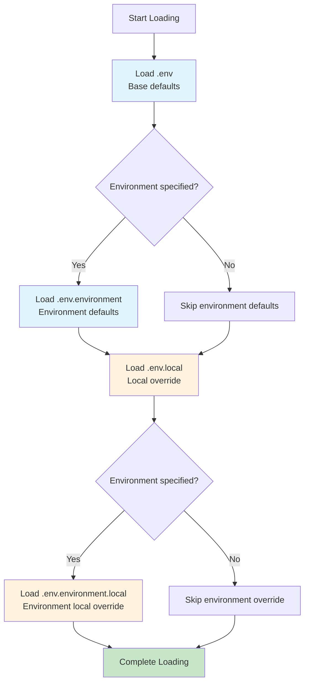

<!--
Maintenance: This document is maintained with reference to the project documentation structure defined in [README.md](../../../../README.md).
Structure: development-guide > development-standards > configuration-management > environment-variable-management
-->
# Environment Variable Management Strategy

## Overview

This document defines the unified environment variable management strategy for projects, ensuring cross-project consistency and maintainability. This strategy applies to all projects using environment variables for configuration management, regardless of programming language or framework.

### Design Principles

1. **Security First**: Sensitive information must never be committed to version control, must be isolated via `.local` files
2. **Consistency Guarantee**: Unified naming conventions, file organization, and loading mechanisms ensure cross-project consistency
3. **Maintainability**: Provide clear template files and documentation for team collaboration and project migration
4. **Compatibility Priority**: Support different tech stacks and deployment environments, maintain maximum flexibility

### Quick Reference

| File Type | Purpose | Commit | Contains | Example |
|-----------|---------|--------|----------|---------|
| `.env` | Default config | Optional | Non-sensitive defaults | `DATABASE_HOST=localhost` |
| `.env.example` | Default template | ✅ Required | All variables (placeholders) | `DATABASE_HOST=your_host` |
| `.env.local` | Local override | ❌ Forbidden | Sensitive info | `DATABASE_PASSWORD=secret` |
| `.env.local.example` | Local template | ✅ Required | Sensitive variables (placeholders) | `DATABASE_PASSWORD=your_password` |
| `.env.{env}` | Environment defaults | Optional | Environment non-sensitive | `DATABASE_HOST=prod-db.example.com` |
| `.env.{env}.example` | Environment template | ✅ Required | Environment variables (placeholders) | `DATABASE_HOST=your_host` |
| `.env.{env}.local` | Environment override | ❌ Forbidden | Environment sensitive | `DATABASE_PASSWORD=prod_secret` |
| `.env.{env}.local.example` | Environment override template | ✅ Required | Environment sensitive (placeholders) | `DATABASE_PASSWORD=your_password` |

### Core Concepts

- **Environment Variables**: Configuration values passed to applications at runtime
- **Sensitive Information**: Passwords, API keys, access tokens, and other credentials that shouldn't be public
- **Non-sensitive Defaults**: Configuration values safe to commit to version control (hostnames, ports, default paths, etc.)
- **Environment**: Application runtime environment (development, production, test, etc.)
- **Template Files**: Files ending with `.example`, showing required environment variables

## Core Principles

### 1. Security Principles

- ✅ **`.env` can be committed** (if it only contains non-sensitive defaults)
- ✅ **All sensitive info stored in `.env.local` or `.env.*.local`**
- ✅ **`.env.local` and `.env.*.local` must be in `.gitignore`**
- ✅ **Sensitive info never committed to version control**

### 2. Consistency Principles

- ✅ **Unified naming**: Use uppercase letters and underscores (e.g., `DATABASE_HOST`)
- ✅ **Unified file location**: Root directory or `config/` directory based on project type
- ✅ **Unified environment identifiers**: Standard environment names (development, production, test)
- ✅ **Unified file naming pattern**: Follow `.env`, `.env.{env}`, `.env.local`, `.env.{env}.local` convention

### 3. Maintainability Principles

- ✅ **Provide clear templates**: Each `.env` file should have corresponding `.env.{env}.example` template
- ✅ **Document all variables**: Add comments in template files
- ✅ **Version control templates**: All `.example` files should be committed

## File Organization

### File Structure

```text
Project Root/
├── config/                    # or root directory
│   ├── .env                   # Default config (committable, non-sensitive only)
│   ├── .env.example           # Default template (commit)
│   ├── .env.local             # Local override (don't commit, contains sensitive)
│   ├── .env.local.example     # Local override template (commit)
│   ├── .env.development       # Development defaults (optional, committable)
│   ├── .env.development.example # Development template (commit)
│   ├── .env.development.local # Development local override (don't commit)
│   ├── .env.development.local.example # Development local template (commit)
│   ├── .env.production        # Production defaults (optional, committable)
│   ├── .env.production.example # Production template (commit)
│   ├── .env.production.local  # Production local override (don't commit)
│   └── .env.production.local.example # Production local template (commit)
```

### Loading Priority

Environment variable file loading order (low to high, later loaded overrides earlier):



**Loading Order** (low to high priority):

1. `.env` (base defaults)
2. `.env.{environment}` (environment-specific defaults)
3. `.env.local` (local override)
4. `.env.{environment}.local` (environment-specific local override, highest priority)

**Implementation Requirement**: Projects need to implement priority-based loading logic, ensuring later-loaded files override same-name variables from earlier files.

## Naming Conventions

### Environment Variable Naming

- **Format**: All uppercase letters, words separated by underscores
- **Prefix**: Use project or module prefix to avoid conflicts
- **Examples**:
  - ✅ `ZENTAO_DB_HOST`
  - ✅ `WECOM_WEBHOOK_TEST`
  - ✅ `LLM_API_KEY`
  - ❌ `zentaoDbHost`
  - ❌ `wecom-webhook-test`
  - ❌ `llmApiKey`

### Environment File Naming

| File Type | Naming Pattern | Example |
|-----------|----------------|---------|
| Base file | `.env` | `.env` |
| Base template | `.env.example` | `.env.example` |
| Local override | `.env.local` | `.env.local` |
| Local override template | `.env.local.example` | `.env.local.example` |
| Environment defaults | `.env.{environment}` | `.env.development` |
| Environment template | `.env.{environment}.example` | `.env.development.example` |
| Environment override | `.env.{environment}.local` | `.env.development.local` |
| Environment override template | `.env.{environment}.local.example` | `.env.development.local.example` |

## Security Best Practices

### 1. .gitignore Configuration

Ensure all project `.gitignore` includes:

```gitignore
# Sensitive environment variable files (must ignore)
.env.local
.env.*.local

# Project-specific config
config/.env.local
config/.env.*.local
```

**Important Notes**:

- `.env` file itself **can be committed** (if only contains non-sensitive defaults)
- `.env.local` and `.env.*.local` **must be ignored**, never commit to version control
- All `.example` files **should be committed** for documentation

### 2. Sensitive Information Classification

#### Must be in `.local` files

- **Passwords**: Database passwords, Redis passwords, service passwords
- **API Keys**: Third-party service API Key, API Secret
- **Access Tokens**: OAuth Token, JWT Secret, Session Secret
- **Certificates and Keys**: SSL certificates, private keys, signing keys
- **Service Credentials**: AWS Access Key, Azure Service Principal, GCP Service Account

#### Can be in `.env` files

- **Hosts and Ports**: Database host, Redis host, service ports
- **Paths and URLs**: API endpoints, service addresses (without credentials)
- **Feature Flags**: Feature toggles, debug mode switches
- **Timeouts and Limits**: Request timeout, connection pool size, retry count
- **Log Levels**: Log output level, log format

## Implementation Examples

### Node.js / JavaScript

```javascript
// config/loadEnv.js
const fs = require('fs');
const path = require('path');
require('dotenv-expand').expand(require('dotenv').config());

function loadEnvFiles(env = process.env.NODE_ENV || 'development') {
  const envDir = path.resolve(process.cwd(), 'config');
  
  // Loading order: low to high priority
  const files = [
    path.join(envDir, '.env'),
    path.join(envDir, `.env.${env}`),
    path.join(envDir, '.env.local'),
    path.join(envDir, `.env.${env}.local`)
  ];
  
  files.forEach(file => {
    if (fs.existsSync(file)) {
      require('dotenv-expand').expand(
        require('dotenv').config({ path: file })
      );
    }
  });
}

module.exports = loadEnvFiles;
```

### Python

```python
# config/load_env.py
import os
from pathlib import Path
from dotenv import dotenv_values

def load_env_files(env=None):
    """Load environment variable files by priority"""
    if env is None:
        env = os.getenv('ENV', 'development')
    
    env_dir = Path(__file__).parent.parent / 'config'
    
    # Loading order: low to high priority
    files = [
        env_dir / '.env',
        env_dir / f'.env.{env}',
        env_dir / '.env.local',
        env_dir / f'.env.{env}.local'
    ]
    
    # Merge all environment variables, later loaded overrides earlier
    config = {}
    for file in files:
        if file.exists():
            config.update(dotenv_values(file))
    
    # Update environment variables
    os.environ.update(config)
    return config

if __name__ == '__main__':
    load_env_files()
```

### Docker Compose

```yaml
version: '3.8'

services:
  app:
    build: .
    env_file:
      - config/.env
      - config/.env.${ENV:-development}
      - config/.env.local
      - config/.env.${ENV:-development}.local
    environment:
      - NODE_ENV=${NODE_ENV:-development}
```

## Checklist

### New Project Setup

- [ ] Create `.env.example` file (all variable templates, commit)
- [ ] Create `.env.local.example` file (local override template, commit)
- [ ] Create `.env` file (non-sensitive defaults only, optional commit)
- [ ] For each environment, create corresponding `.env.{env}.example` template (if using environment-specific config)
- [ ] For each environment, create corresponding `.env.{env}.local.example` template (if using environment-specific config)
- [ ] Add `.env.local` and `.env.*.local` rules to `.gitignore`
- [ ] Implement priority-based environment variable loading logic in code
- [ ] Ensure `.env` file contains no sensitive information
- [ ] Document environment variable configuration steps in README or project docs

### Existing Project Review

- [ ] Confirm `.env.local` and `.env.*.local` in `.gitignore`
- [ ] Confirm `.env` file only contains non-sensitive defaults (if committed)
- [ ] Confirm each environment's `.env` file has corresponding `.env.{env}.example` template
- [ ] Confirm each environment's `.env.{env}.local` file has corresponding `.env.{env}.local.example` template
- [ ] Confirm all `.example` files committed to version control
- [ ] Confirm sensitive info migrated to `.env.local` files
- [ ] Confirm environment variable loading logic supports priority loading
- [ ] Confirm sensitive info not committed to version control
- [ ] Review Git history, confirm no sensitive info ever committed

## References

- [The Twelve-Factor App - Config](https://12factor.net/config)
- [dotenv Best Practices](https://github.com/motdotla/dotenv#best-practices)
- [Environment Variables in Production](https://docs.docker.com/compose/environment-variables/)
- [OWASP - Secrets Management](https://cheatsheetseries.owasp.org/cheatsheets/Secrets_Management_Cheat_Sheet.html)
- [GitHub Security Best Practices](https://docs.github.com/en/code-security/secret-scanning)

## Version History

| Version | Date | Changes | Author |
|---------|------|---------|--------|
| 1.0 | YYYY-MM-DD | Initial version | `[Author]` |

---

**AI Filling Guide**:
- Environment variable examples should be adapted to project tech stack
- File paths and directory structure can be adjusted per project conventions
- Loading logic examples should match the project's runtime environment
