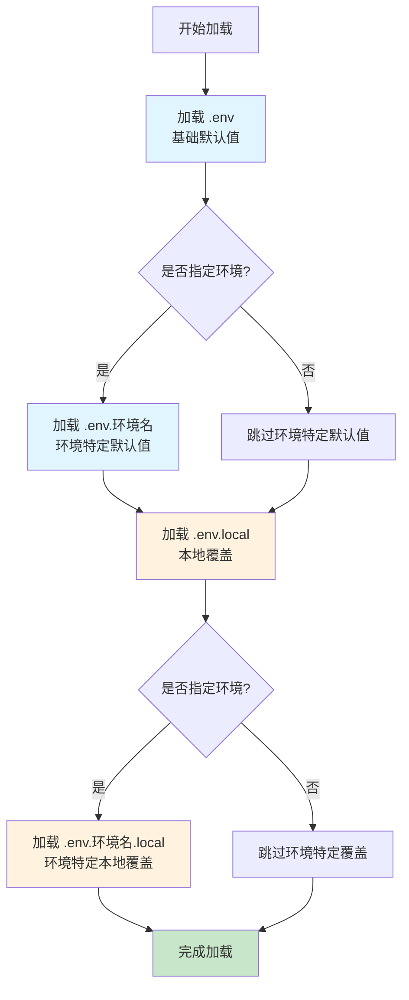

# 统一 .env 环境变量管理策略

## 📋 概述

本文档定义了项目的统一环境变量管理策略，确保跨项目的一致性和可维护性。本策略适用于所有使用环境变量进行配置管理的项目，无论使用何种编程语言或框架。

### 设计原则

1. **安全性优先**：敏感信息绝不提交到版本控制系统，必须通过 `.local` 文件隔离
2. **一致性保证**：统一的命名规范、文件组织方式和加载机制，确保跨项目的一致性
3. **可维护性**：提供清晰的模板文件和文档，便于团队协作和项目迁移
4. **兼容性优先**：支持不同技术栈和部署环境，保持最大的灵活性

### 快速参考

| 文件类型 | 用途 | 是否提交 | 包含内容 | 示例 |
|---------|------|---------|---------|------|
| `.env` | 默认配置 | 可选 | 非敏感默认值 | `DATABASE_HOST=localhost` |
| `.env.example` | 默认配置模板 | ✅ 必须 | 所有环境变量（占位符） | `DATABASE_HOST=your_host` |
| `.env.local` | 本地覆盖 | ❌ 禁止 | 敏感信息 | `DATABASE_PASSWORD=secret` |
| `.env.local.example` | 本地覆盖模板 | ✅ 必须 | 敏感变量（占位符） | `DATABASE_PASSWORD=your_password` |
| `.env.{环境}` | 环境特定默认值 | 可选 | 环境非敏感值 | `DATABASE_HOST=prod-db.example.com` |
| `.env.{环境}.example` | 环境特定模板 | ✅ 必须 | 环境变量（占位符） | `DATABASE_HOST=your_host` |
| `.env.{环境}.local` | 环境特定覆盖 | ❌ 禁止 | 环境敏感信息 | `DATABASE_PASSWORD=prod_secret` |
| `.env.{环境}.local.example` | 环境特定覆盖模板 | ✅ 必须 | 环境敏感变量（占位符） | `DATABASE_PASSWORD=your_password` |

### 核心概念

- **环境变量**：在运行时传递给应用程序的配置值
- **敏感信息**：密码、API 密钥、访问令牌等不应公开的凭证信息
- **非敏感默认值**：可以安全地提交到版本控制的配置值（如主机名、端口号、默认路径等）
- **环境**：应用程序运行的环境（development、production、test 等）
- **模板文件**：以 `.example` 结尾的文件，用于展示需要配置的环境变量

## 🎯 核心原则

### 1. 安全性原则

- ✅ **`.env` 可以提交到版本控制**（前提是只包含非敏感默认值）
- ✅ **所有敏感信息存储在 `.env.local` 或 `.env.*.local` 文件中**
- ✅ **`.env.local` 和 `.env.*.local` 文件必须被 `.gitignore` 忽略**
- ✅ **敏感信息绝不提交到版本控制系统**

### 2. 一致性原则

- ✅ **统一命名规范**：使用大写字母和下划线（如 `DATABASE_HOST`）
- ✅ **统一文件位置**：根据项目类型选择根目录或 `config/` 目录
- ✅ **统一环境标识**：使用标准环境名称（development、production、test）
- ✅ **统一文件命名模式**：遵循 `.env`、`.env.{环境}`、`.env.local`、`.env.{环境}.local` 的命名约定

### 3. 可维护性原则

- ✅ **提供清晰的模板文件**：每个环境的 `.env` 文件都应有对应的 `.env.{环境}.example` 模板
- ✅ **文档化所有环境变量**：在模板文件中添加注释说明
- ✅ **版本控制模板文件**：所有 `.example` 文件都应提交到版本控制

## 📁 文件组织规范

### 文件结构

```text
项目根目录/
├── config/                    # 或根目录
│   ├── .env                   # 默认配置（可提交，仅非敏感值）
│   ├── .env.example           # 默认配置模板（提交）
│   ├── .env.local             # 本地覆盖（不提交，包含敏感信息）
│   ├── .env.local.example     # 本地覆盖配置模板（提交）
│   ├── .env.development       # 开发环境默认值（可选，可提交）
│   ├── .env.development.example # 开发环境配置模板（提交）
│   ├── .env.development.local # 开发环境本地覆盖（不提交）
│   ├── .env.development.local.example # 开发环境本地覆盖模板（提交）
│   ├── .env.production        # 生产环境默认值（可选，可提交）
│   ├── .env.production.example # 生产环境配置模板（提交）
│   ├── .env.production.local  # 生产环境本地覆盖（不提交）
│   ├── .env.production.local.example # 生产环境本地覆盖模板（提交）
│   ├── .env.test              # 测试环境默认值（可选，可提交）
│   ├── .env.test.example      # 测试环境配置模板（提交）
│   ├── .env.test.local        # 测试环境本地覆盖（不提交）
│   └── .env.test.local.example # 测试环境本地覆盖模板（提交）
```

### 文件分类与说明

#### 必需文件（必须提交）

| 文件 | 说明 |
|------|------|
| `.env.example` | 基础配置模板，展示所有需要配置的环境变量（包括占位符） |
| `.env.local.example` | 本地覆盖配置模板，展示需要配置的敏感变量 |

#### 可选文件（可提交，如果包含非敏感默认值）

| 文件 | 说明 |
|------|------|
| `.env` | 基础配置文件，包含所有非敏感默认值 |
| `.env.{环境}.example` | 环境特定配置模板，如果使用环境特定配置，必须提交 |
| `.env.{环境}.local.example` | 环境特定本地覆盖模板，如果使用环境特定配置，必须提交 |
| `.env.{环境}` | 环境特定配置文件，包含该环境的非敏感默认值 |

#### 禁止提交的文件

| 文件 | 说明 |
|------|------|
| `.env.local` | 本地覆盖文件，包含敏感信息，禁止提交 |
| `.env.{环境}.local` | 环境特定本地覆盖文件，包含敏感信息，禁止提交 |

### 加载优先级

环境变量文件的加载顺序（从低到高，后加载的会覆盖先加载的）：



**加载顺序**（从低到高优先级）：

1. `.env`（基础默认值）
2. `.env.{环境名}`（环境特定默认值）
3. `.env.local`（本地覆盖）
4. `.env.{环境名}.local`（环境特定本地覆盖，最高优先级）

**实现要求**：项目需要实现按优先级加载环境变量文件的逻辑，确保后加载的文件会覆盖先加载的文件中的同名变量。

## 📝 命名规范

### 环境变量命名

- **格式**：全大写字母，单词间用下划线分隔
- **前缀**：使用项目或模块前缀避免冲突
- **示例**：
  - ✅ `ZENTAO_DB_HOST`
  - ✅ `WECOM_WEBHOOK_TEST`
  - ✅ `LLM_API_KEY`
  - ❌ `zentaoDbHost`
  - ❌ `wecom-webhook-test`
  - ❌ `llmApiKey`

### 环境文件命名

| 文件类型 | 命名模式 | 示例 |
|---------|---------|------|
| 基础文件 | `.env` | `.env` |
| 基础模板 | `.env.example` | `.env.example` |
| 本地覆盖 | `.env.local` | `.env.local` |
| 本地覆盖模板 | `.env.local.example` | `.env.local.example` |
| 环境特定默认值 | `.env.{环境名}` | `.env.development` |
| 环境特定模板 | `.env.{环境名}.example` | `.env.development.example` |
| 环境特定覆盖 | `.env.{环境名}.local` | `.env.development.local` |
| 环境特定覆盖模板 | `.env.{环境名}.local.example` | `.env.development.local.example` |

**命名规则**：

- 每个环境的 `.env` 文件都应该有对应的 `.env.{环境名}.example` 模板文件
- 每个环境的 `.env.{环境名}.local` 文件都应该有对应的 `.env.{环境名}.local.example` 模板文件
- 所有 `.example` 文件都可以提交到版本控制，用于展示需要配置的环境变量
- 环境名称使用小写字母，多个单词用连字符分隔（如 `development`、`production`、`test`）

## 🔐 安全最佳实践

### 1. .gitignore 配置

确保所有项目的 `.gitignore` 包含以下规则：

```gitignore
# 敏感环境变量文件（必须忽略）
.env.local
.env.*.local

# 项目特定配置
config/.env.local
config/.env.*.local
```

**重要说明**：

- `.env` 文件本身**可以提交**（如果只包含非敏感默认值）
- `.env.local` 和 `.env.*.local` **必须忽略**，绝不能提交到版本控制
- 所有 `.example` 文件**应该提交**，用于文档化环境变量

### 2. 敏感信息分类

#### 必须放在 `.local` 文件中的信息

- **密码**：数据库密码、Redis 密码、服务密码等
- **API 密钥**：第三方服务的 API Key、API Secret
- **访问令牌**：OAuth Token、JWT Secret、Session Secret
- **证书和密钥**：SSL 证书、私钥、签名密钥
- **服务凭证**：AWS Access Key、Azure Service Principal、GCP Service Account

#### 可以放在 `.env` 文件中的信息

- **主机和端口**：数据库主机、Redis 主机、服务端口
- **路径和 URL**：API 端点、服务地址（不含凭证）
- **功能开关**：功能标志、调试模式开关
- **超时和限制**：请求超时、连接池大小、重试次数
- **日志级别**：日志输出级别、日志格式

### 3. 文件内容规范

#### .env 文件规范

- 只包含非敏感的默认配置值
- 使用注释说明哪些变量需要在 `.env.local` 中配置
- 为所有环境变量提供有意义的默认值
- 使用清晰的分组注释组织相关配置

#### .env.local 文件规范

- 只包含敏感信息覆盖
- 不包含非敏感配置（这些应该在 `.env` 中）
- 每个开发者根据本地环境独立配置
- 使用注释说明变量的用途和来源

#### .example 文件规范

- 包含所有需要配置的环境变量
- 使用占位符值（如 `your_username`、`your_password`）
- 添加详细的注释说明每个变量的用途
- 包含使用说明（如何复制和配置）

## 🛠️ 实现指南

### Node.js / JavaScript

使用 `dotenv` 和 `dotenv-expand` 实现优先级加载：

```javascript
// config/loadEnv.js
const fs = require('fs');
const path = require('path');
require('dotenv-expand').expand(require('dotenv').config());

function loadEnvFiles(env = process.env.NODE_ENV || 'development') {
  const envDir = path.resolve(process.cwd(), 'config');
  
  // 加载顺序：从低到高优先级
  const files = [
    path.join(envDir, '.env'),
    path.join(envDir, `.env.${env}`),
    path.join(envDir, '.env.local'),
    path.join(envDir, `.env.${env}.local`)
  ];
  
  files.forEach(file => {
    if (fs.existsSync(file)) {
      require('dotenv-expand').expand(
        require('dotenv').config({ path: file })
      );
    }
  });
}

module.exports = loadEnvFiles;
```

### Python

使用 `python-dotenv` 实现优先级加载：

```python
# config/load_env.py
import os
from pathlib import Path
from dotenv import dotenv_values

def load_env_files(env=None):
    """按优先级加载环境变量文件"""
    if env is None:
        env = os.getenv('ENV', 'development')
    
    env_dir = Path(__file__).parent.parent / 'config'
    
    # 加载顺序：从低到高优先级
    files = [
        env_dir / '.env',
        env_dir / f'.env.{env}',
        env_dir / '.env.local',
        env_dir / f'.env.{env}.local'
    ]
    
    # 合并所有环境变量，后加载的会覆盖先加载的
    config = {}
    for file in files:
        if file.exists():
            config.update(dotenv_values(file))
    
    # 更新环境变量
    os.environ.update(config)
    return config

if __name__ == '__main__':
    load_env_files()
```

### Go

使用第三方库实现优先级加载：

```go
// config/load_env.go
package config

import (
    "fmt"
    "os"
    "path/filepath"
    "github.com/joho/godotenv"
)

func LoadEnvFiles(env string) error {
    if env == "" {
        env = os.Getenv("ENV")
        if env == "" {
            env = "development"
        }
    }
    
    envDir := filepath.Join(".", "config")
    
    // 加载顺序：从低到高优先级
    files := []string{
        filepath.Join(envDir, ".env"),
        filepath.Join(envDir, fmt.Sprintf(".env.%s", env)),
        filepath.Join(envDir, ".env.local"),
        filepath.Join(envDir, fmt.Sprintf(".env.%s.local", env)),
    }
    
    for _, file := range files {
        if _, err := os.Stat(file); err == nil {
            if err := godotenv.Load(file); err != nil {
                return err
            }
        }
    }
    
    return nil
}
```

### Docker Compose

在 `docker-compose.yml` 中使用环境变量：

```yaml
version: '3.8'

services:
  app:
    build: .
    env_file:
      - config/.env
      - config/.env.${ENV:-development}
      - config/.env.local
      - config/.env.${ENV:-development}.local
    environment:
      - NODE_ENV=${NODE_ENV:-development}
```

## 📚 迁移指南

### 从传统模式迁移到 .env + .env.local 模式

如果项目当前使用 `.env` 包含所有配置（包括敏感信息），需要迁移到新策略：

1. **分离敏感信息**：
   - 创建 `.env.local` 文件
   - 将敏感信息从 `.env` 移动到 `.env.local`
   - 可以使用脚本或手动编辑完成

2. **清理 .env 文件**：
   - 保留所有非敏感默认值
   - 移除所有密码、密钥、API Token 等敏感信息
   - 添加注释说明哪些变量应该在 `.env.local` 中配置

3. **创建模板文件**：
   - 创建 `.env.example` 文件，包含所有环境变量（使用占位符）
   - 创建 `.env.local.example` 文件，包含所有敏感变量（使用占位符）

4. **更新 .gitignore**：
   - 添加 `.env.local` 和 `.env.*.local` 规则
   - 确认 `.env` 文件是否应该提交（如果只包含非敏感值）

5. **更新加载逻辑**：
   - 实现优先级加载（先加载 `.env`，再加载 `.env.local`）
   - 确保 `.env.local` 中的值会覆盖 `.env` 中的值

6. **更新文档**：
   - 说明 `.env` 和 `.env.local` 的用途
   - 提供迁移步骤和示例

### 从根目录迁移到 config/ 目录

如果要将 `.env` 文件从根目录迁移到 `config/` 目录：

1. **创建目录**：`mkdir -p config`
2. **移动文件**：

   ```bash
   mv .env config/.env
   mv .env.local config/.env.local  # 如果存在
   mv .env.example config/.env.example  # 如果存在
   mv .env.*.example config/  # 移动所有 example 文件
   ```

3. **更新代码**：修改环境变量加载逻辑，指向新路径
4. **更新 .gitignore**：更新路径规则（如 `config/.env.local`）
5. **更新文档**：更新相关文档说明新的文件位置

## ✅ 检查清单

### 新项目设置

- [ ] 创建 `.env.example` 文件（包含所有环境变量的模板，提交）
- [ ] 创建 `.env.local.example` 文件（本地覆盖配置模板，提交）
- [ ] 创建 `.env` 文件（仅包含非敏感默认值，可选提交）
- [ ] 为每个环境创建对应的 `.env.{环境}.example` 模板文件（如果使用环境特定配置）
- [ ] 为每个环境创建对应的 `.env.{环境}.local.example` 模板文件（如果使用环境特定配置）
- [ ] 在 `.gitignore` 中添加 `.env.local` 和 `.env.*.local` 规则
- [ ] 在代码中实现环境变量优先级加载逻辑
- [ ] 确保 `.env` 文件不包含任何敏感信息
- [ ] 在 README 或项目文档中说明环境变量配置步骤

### 现有项目审查

- [ ] 确认 `.env.local` 和 `.env.*.local` 在 `.gitignore` 中
- [ ] 确认 `.env` 文件只包含非敏感默认值（如果提交）
- [ ] 确认每个环境的 `.env` 文件都有对应的 `.env.{环境}.example` 模板
- [ ] 确认每个环境的 `.env.{环境}.local` 文件都有对应的 `.env.{环境}.local.example` 模板
- [ ] 确认所有 `.example` 文件已提交到版本控制
- [ ] 确认敏感信息已迁移到 `.env.local` 文件
- [ ] 确认环境变量加载逻辑支持优先级加载
- [ ] 确认敏感信息未提交到版本控制
- [ ] 审查 Git 历史，确认没有敏感信息被提交过

## 🔍 常见问题

### Q1: `.env` 文件应该提交吗？

**A**: 如果 `.env` 文件只包含非敏感的默认值（如 `DATABASE_HOST=localhost`、`PORT=5000`），可以提交。如果包含任何敏感信息，应该：

1. 将敏感信息移动到 `.env.local`
2. 清理 `.env` 文件
3. 创建 `.env.example` 作为模板

### Q2: 如何区分敏感和非敏感信息？

**A**: 敏感信息包括密码、密钥、令牌等凭证。非敏感信息包括主机名、端口号、路径、功能开关等。如果不确定，建议将其视为敏感信息。

### Q3: 环境特定配置文件是必需的吗？

**A**: 不是必需的。如果项目只有一个环境或所有环境使用相同配置，只需要 `.env` 和 `.env.local`。如果不同环境有不同配置，建议使用环境特定文件。

### Q4: 如何确保敏感信息不被提交？

**A**:

1. 在 `.gitignore` 中正确配置忽略规则
2. 使用 Git hooks 检查提交内容
3. 定期审查 Git 历史
4. 使用工具扫描提交历史中的敏感信息

### Q5: 模板文件应该包含什么内容？

**A**: 模板文件应该：

- 包含所有需要配置的环境变量
- 使用占位符值（如 `your_username`、`your_password`）
- 添加详细注释说明每个变量的用途
- 包含使用说明

### Q6: 如何在不同环境中使用不同的配置？

**A**: 使用环境特定文件：

1. 创建 `.env.development`、`.env.production` 等环境特定文件
2. 在加载逻辑中根据 `NODE_ENV` 或类似的环境变量选择对应的文件
3. 确保每个环境都有对应的 `.example` 模板文件

## 📅 版本历史

- **v1.0**（2025-01-XX）：初始版本，定义统一的环境变量管理策略

## 📖 参考资料

- [The Twelve-Factor App - Config](https://12factor.net/config) - 十二要素应用配置管理原则
- [dotenv 最佳实践](https://github.com/motdotla/dotenv#best-practices) - Node.js 环境变量管理
- [Environment Variables in Production](https://docs.docker.com/compose/environment-variables/) - Docker 环境变量管理
- [OWASP - Secrets Management](https://cheatsheetseries.owasp.org/cheatsheets/Secrets_Management_Cheat_Sheet.html) - 密钥管理安全最佳实践
- [GitHub Security Best Practices](https://docs.github.com/en/code-security/secret-scanning) - GitHub 密钥扫描和安全实践
