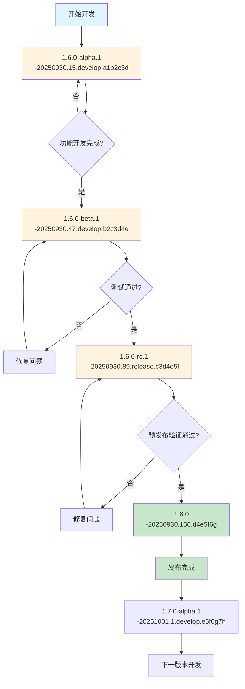

# 语义化版本管理规范

## 概述

本文档基于语义化版本控制 2.0.0 规范，定义了完整的版本号管理标准。通过精确规范版本号与开发阶段、迭代周期、构建过程、分支策略、提交哈希等核心要素的映射关系，构建统一的版本管理体系，确保软件开发生命周期中版本信息的一致性、可追溯性和实用性。

### 设计原则

1. **语义明确性**：版本号能够清晰表达软件变更的性质和规模
2. **一致性保证**：跨阶段、分支、构建、环境的版本标识保持一致
3. **可追溯性**：任何版本都能追溯到具体的代码状态和构建信息
4. **兼容性优先**：在遵循 SemVer 2.0.0 规范的基础上，优先考虑实际应用的兼容性（如 Docker、包管理器等）

### 快速参考

| 组成部分 | 格式 | 示例 |
|---------|------|------|
| **完整版本号** | `<major>.<minor>.<patch>[-<prerelease>][-<buildmetadata>]` | `1.6.0-beta.1-20251010.256.4d798ed` |
| **预发布标识** | `<stage>[.<iteration>]` | `alpha.1`, `beta.2`, `rc.1` |
| **构建元数据** | `<timestamp>.<buildnumber>[.<branch>].<githash>` | `20251010.256.4d798ed` |

## 版本号格式规范

### 基本格式

基于语义化版本控制 2.0.0 规范，采用兼容性更好的格式：

```text
<major>.<minor>.<patch>[-<prerelease>][-<buildmetadata>]
```

**中文对照**：

```text
主版本号.次版本号.修订版本号[-预发布标识符][-构建元数据]
```

### 重要说明

本规范为了确保跨平台兼容性，**主动放弃了语义化版本规范中的 `+` 号**，统一使用 `-` 号分隔构建元数据。

#### 原因

- Docker 标签规范不允许使用 `+` 号
- 大多数包管理器（npm、pip、maven 等）对 `+` 号支持有限
- Kubernetes 资源名称不支持 `+` 号
- 文件系统在某些情况下对 `+` 号处理不当

#### 语义影响

- 在 SemVer 规范中，`+` 号用于构建元数据，`-` 号用于预发布版本
- 本规范将构建元数据改为使用 `-` 号，**改变了版本号的语义**
- 例如：`1.6.0-alpha.1-20250930.001.develop.a1b2c3d` 在 SemVer 中会被解析为预发布版本，而非正式版本+构建元数据

#### 权衡

虽然改变了 SemVer 的语义，但确保了版本号在各种实际应用场景中的可用性和一致性。

### 组成部分说明

1. **主版本号（Major）**：包含破坏性变更时递增
2. **次版本号（Minor）**：添加新功能但保持向后兼容时递增
3. **修订版本号（Patch）**：进行向后兼容的 bug 修复时递增
4. **预发布标识符**：表示版本的成熟度和稳定性，影响版本优先级排序
5. **构建元数据**：包含构建相关信息，不影响版本优先级，仅用于标识和追溯

## 版本号递增计算规则

### 基本递增规则

| 版本类型 | 递增条件 | 重置规则 | 示例 |
|----------|----------|----------|------|
| **主版本号** | 破坏性变更（API 不兼容、数据结构变更） | 次版本号和修订版本号重置为 0 | `1.5.3` → `2.0.0` |
| **次版本号** | 向后兼容的新功能 | 修订版本号重置为 0 | `1.5.3` → `1.6.0` |
| **修订版本号** | 向后兼容的 bug 修复 | 无重置 | `1.5.3` → `1.5.4` |

### 预发布版本规则

- **阶段内递增**：`1.6.0-alpha.1` → `1.6.0-alpha.2`
- **阶段间递增**：`1.6.0-alpha.2` → `1.6.0-beta.1`
- **正式发布**：`1.6.0-rc.3` → `1.6.0`
- **阶段优先级**：`alpha` < `beta` < `rc` < 正式版本

### 预发布标识符结构

**预发布标识符部分（`-<prerelease>`）**：

- **stage**：开发阶段标识（alpha、beta、rc）
- **iteration**：同一阶段内的迭代序号（可选，纯数字，如 1、2、3）
- **格式**：`<stage>[.<iteration>]`

**构建元数据部分（`-<buildmetadata>`）**：

- **构建时间戳**：构建时间标识（必需，格式：YYYYMMDD，仅包含日期部分）
- **构建序号**：区分同一天的不同构建（必需）
  - **CI/CD 构建**：使用 Jenkins BUILD_NUMBER（如 93、123、156）
  - **本地打包**：使用时分秒格式 HHMMSS（如 175357 表示 17:53:57，仅用于临时测试）
- **构建分支**：非主分支时包含分支信息（主分支如 main、master 时隐藏）
- **Git 哈希**：提交哈希值（必需，7 位短哈希）
- **格式**：`<timestamp>.<buildnumber>[.<branch>].<githash>`

### 重要约束

- **环境信息**（dev、test、staging、prod）不属于版本号，应通过部署配置管理
- **分支信息**（feature、hotfix、bugfix 等）不属于版本号，应放在构建元数据中
- **iteration 仅为数字**：不包含 dev、hotfix、feat 等分支类型信息
- 同一版本可以部署到不同环境，环境不应影响版本标识

## 版本示例

### 常见版本示例

| 版本类型 | 版本号示例 | 说明 |
|----------|------------|------|
| **CI/CD 构建（主分支）** | `1.5.0-beta.1-20251010.256.4d798ed` | Jenkins 构建，BUILD_NUMBER=256 |
| **CI/CD 构建（开发分支）** | `1.6.0-alpha.1-20250930.93.develop.a1b2c3d` | develop 分支，BUILD_NUMBER=93 |
| **本地打包（主分支）** | `1.5.0-beta.1-20251010.175357.4d798ed` | package.sh 打包，时间戳 175357 (17:53:57) |
| **本地打包（功能分支）** | `1.6.0-alpha.1-20251010.143052.feature.e5f6g7h` | package.sh 打包，时间 143052 (14:30:52) |
| **候选版本** | `1.6.0-rc.1-20250930.156.release.c3d4e5f` | release 分支的 rc 版本 |
| **正式版本** | `1.6.0-20250930.200.d4e5f6g` | 主分支的正式版本 |

**构建序号说明**：

- **CI/CD 构建**（Jenkins）：使用 BUILD_NUMBER
  - 格式：纯数字，如 `93`、`156`、`256`
  - 优点：唯一性强，自动递增，便于追踪
  - 生成：Jenkins Pipeline 中通过 `${BUILD_NUMBER}` 变量自动获取

- **本地打包**：使用时分秒格式 HHMMSS
  - 格式：6 位时间，如 `175357` (17:53:57)、`143052` (14:30:52)
  - 优点：无需构建服务器，时间可排序，易于区分
  - 用途：仅用于本地临时测试（package.sh），生产环境使用 Jenkins 构建

- **分支处理**：
  - 主分支（main、master）：隐藏分支信息
  - 非主分支（develop、feature 等）：包含分支信息

## 版本生命周期工作流

### 完整生命周期图



**版本号说明**：

- **构建序号**：15、47、89、156、1 为 Jenkins BUILD_NUMBER
- **分支信息**：
  - develop 分支：包含分支信息 `develop`
  - release 分支：包含分支信息 `release`
  - main/master 分支：分支信息隐藏（正式版本）

### 关键节点控制

| 节点 | 控制条件 | 负责角色 | 输出产物 |
|------|----------|----------|----------|
| **开发完成** | 功能实现完整，单元测试通过 | 开发团队 | alpha 版本 |
| **测试通过** | 集成测试、系统测试通过 | 测试团队 | beta 版本 |
| **预发布验证** | 性能测试、安全测试通过 | 运维团队 | rc 版本 |
| **正式发布** | 业务验收、发布审批通过 | 产品团队 | 正式版本 |

## 版本文件管理

### 项目版本文件说明

项目使用两个文件来管理版本信息：

#### 1. `VERSION` - 原始版本号

**用途：** 存储项目的语义化版本号

**维护者：** 开发团队手动维护

**格式：** 遵循语义化版本控制规范

```
{MAJOR}.{MINOR}.{PATCH}[-{PRERELEASE}]

示例：
1.5.0
1.5.0-beta.1
2.0.0-rc.1
```

**使用场景：**

- 版本规划和发布管理
- Git 标签创建
- 文档版本标识
- 变更日志记录

#### 2. `VERSION.build` - 构建版本号

**用途：** 存储完整的构建版本信息

**生成者：** CI/CD 系统（如 Jenkins）在构建过程中自动生成

**格式：**

- **CI/CD 构建**：`{VERSION}-{TIMESTAMP}.{BUILD_NUMBER}[.{BRANCH}].{COMMIT_HASH}`

```
示例：
1.5.0-beta.1-20251010.256.4d798ed    (主分支，BUILD_NUMBER=256)
1.6.0-alpha.1-20250930.93.develop.a1b2c3d  (develop 分支，BUILD_NUMBER=93)
```

**使用场景：**

- 实际部署和运行
- Docker 镜像标签
- 问题追踪和回滚
- 构建产物管理

### 版本工作流程

| 阶段 | 职责 | 关键产物 |
|------|------|---------|
| **开发阶段** | 版本规划和语义化版本管理 | `VERSION` 文件 |
| **构建阶段** | CI/CD 自动生成完整版本号，构建镜像和发布包 | `VERSION.build` 文件、Docker 镜像、发布包 |
| **部署阶段** | 使用 `VERSION.build` 部署已构建的版本 | 运行环境 |

**核心原则：**

- **分离关注点**：VERSION 用于版本规划，VERSION.build 用于实际部署
- **构建一次，多处部署**：同一构建产物可部署到不同环境
- **避免版本不匹配**：部署脚本使用 VERSION.build 而非 VERSION，确保版本与镜像标签一致

### 常用命令

```bash
# 查看版本信息
cat VERSION        # 原始语义化版本
cat VERSION.build  # 完整构建版本

# 更新版本号
echo "1.6.0" > VERSION
git add VERSION
git commit -m "chore: bump version to 1.6.0"
git tag -a v1.6.0 -m "Release v1.6.0"
```

## 参考资料

- [语义化版本规范 2.0.0](https://semver.org/lang/zh-CN/) - 本规范基于此标准，但为兼容性考虑使用 `-` 号替代 `+` 号
- [Git 分支管理最佳实践](https://nvie.com/posts/a-successful-git-branching-model/)
- [持续集成与持续部署指南](https://martinfowler.com/articles/continuousIntegration.html)
- [软件配置管理最佳实践](https://www.ibm.com/docs/en/engineering-lifecycle-management-suite/lifecycle-management/6.0.6)
- [版本控制系统设计原则](https://git-scm.com/book/zh/v2)
